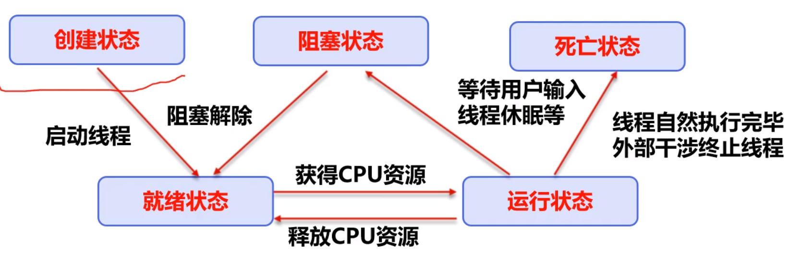
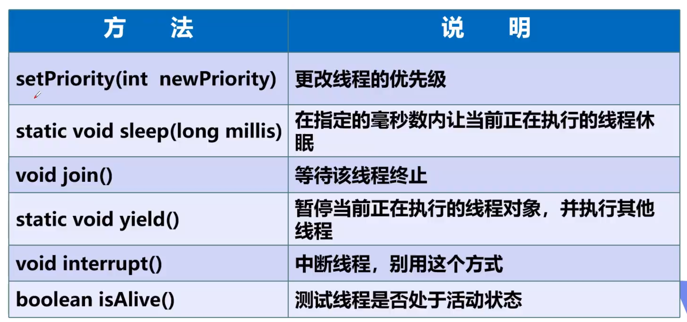

[TOC]

### 进程 VS 线程
线程是操作系统能够进行运算调度的最小单位。大部分情况下，它被包含在进程之中，是进程中的实际运作单位。一条线程指的是进程中一个单一顺序的控制流，一个进程中可以并发多个线程，每条线程并行执行不同的任务。在Unix System V及SunOS中也被称为轻量进程，但轻量进程更多指内核线程，而把用户线程称为线程。

### 三种创建方式
- 继承Thread类
- 实现Runnable接口
- 实现callable接口

**继承Thread类**
- 继承Thread类
- 重新run方法
- 新建Thread实例，调用start方法
```
public class Test1Thread extends Thread {
    @Override
    public void run() {
        for (int i = 0; i < 10; i++) {
            System.out.println(i);
        }
    }

    public static void main(String[] args) {
        for (int i = 0; i < 10; i++) {
            new Test1Thread().start();
        }
    }
}
```

**实现Runnable接口**
- 实现Runnable接口
- 将类的实例当做参数传给Thread类
- 调用Thread实例的start方法
```
public class Test2Runnable implements Runnable {
    @Override
    public void run() {
        for (int i = 0; i < 10; i++) {
            System.out.println(i);
        }
    }

    public static void main(String[] args) {
        for (int i = 0; i < 10; i++) {
            new Thread(new Test2Runnable()).start();
        }
    }
}
```

**模拟并发问题**
```
public class Test3 implements Runnable {
    public static Integer num = 100;

    private String name;

    public Test3(String name) {
        this.name = name;
    }

    @Override
    public void run() {
        while (num > 0) {
            try {
                Thread.sleep(10);
            } catch (InterruptedException e) {
                e.printStackTrace();
            }
            System.out.println(name + " get ticket " + num--);
        }
    }

    public static void main(String[] args) {
        for (int i = 0; i < 10; i++) {
            new Thread(new Test3("user" + i)).start();
        }
    }
}

```

### 线程状态
- 创建状态
- 就绪状态
- 阻塞状态
- 运行状态
- 死亡状态


### 线程方法


### 线程优先级
Java提供一个线程调度器来监控程序中启动后进入就绪状态的所有线程，线程调度器按照优先级决定应该调度哪个线程来执行。

线程的优先级用数字表示，范围从1~10。
- Thread.MIN_PRIORITY = 1
- Thread.MAX_PRIORITY = 10
- Thread.NORM_PRIORITY = 5

getPriority()
setPriority(int xxx)

### 守护线程 daemon
- 线程分为用户线程和守护线程
- 虚拟机必须确保用户线程执行完毕
- 虚拟机不用等待守护线程执行完毕

```
public class Test4Daemon {
    public static void main(String[] args) {
        Thread daemon = new Thread(() -> {
            while (true) {
                System.out.println("daemon thread running");
            }
        });
        daemon.setDaemon(true);

        Thread user = new Thread(() -> {
            for (int i = 0; i < 100; i++) {
                System.out.println("user thread running " + i);
            }
        });
        user.setDaemon(false);

        daemon.start();
        user.start();
    }
}
```


### 线程同步
多个线程同时修改同一个对象时，需要线程同步来保证安全。线程同步是一种等待机制，线程进入对象的等待池，先进先出。

**同步方法**
```
public synchronized void method(int args) {}
```

**同步块**
```
synchronized(obj){}
```